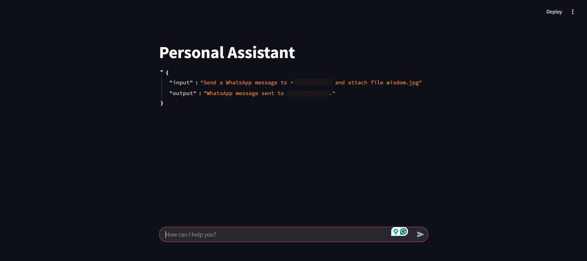
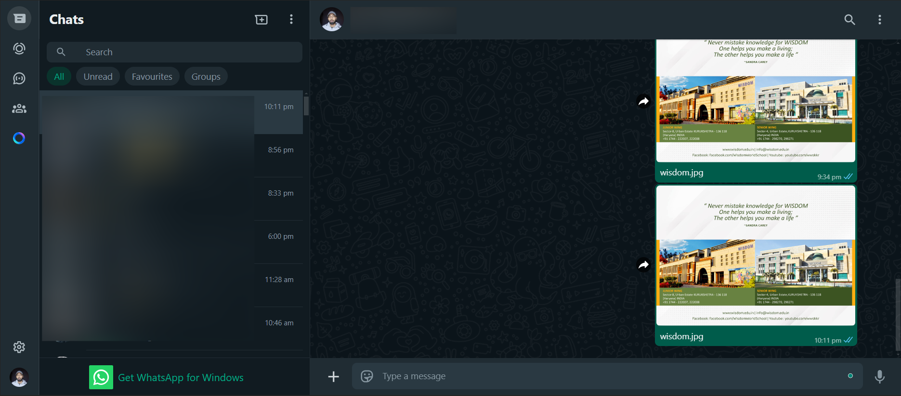
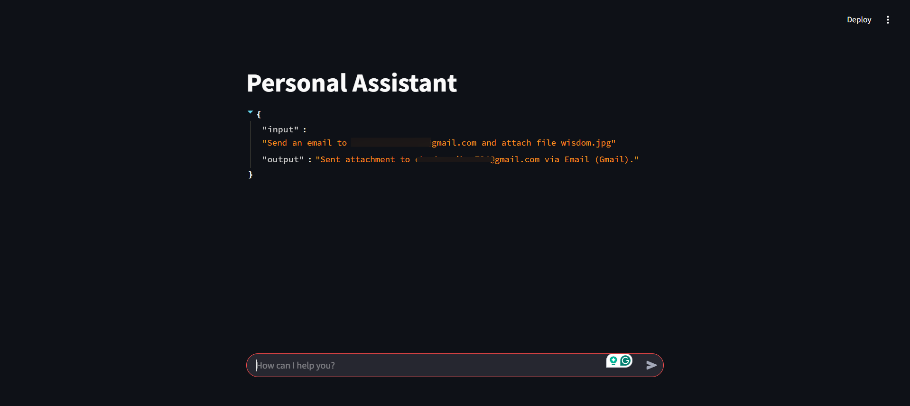
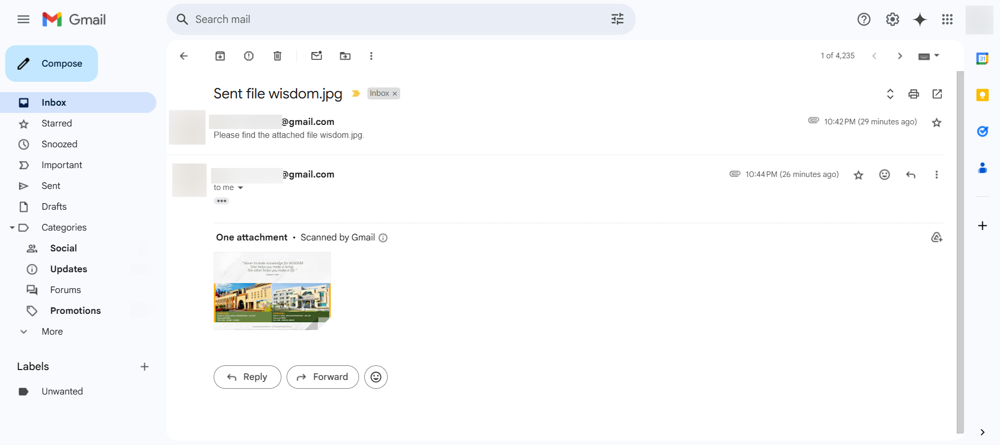

# Personal Assistant Streamlit App

## Overview

This Streamlit application integrates with an LLM (DeepSeek-R1 via Ollama) to send emails and WhatsApp messages with attachments based on user prompts. The app supports multi-agent decision-making using LangChain.

## Project Structure

```
.
├── brochures/                  # Contains attachment files
│   ├── careeerpoint.jpg
│   ├── dhirubhai_ambani.jpg
│   ├── european.jpg
│   ├── kanakia.jpg
│   ├── krmangalam.jpg
│   ├── madeeasy.jpg
│   ├── pinnacle.jpg
│   ├── pride.jpg
│   ├── wisdom.jpg
├── venv/                       # Virtual environment directory
├── .env                        # Environment variables file (not to be committed)
├── .gitignore                  # Git ignore file
├── app.py                      # Main application file
├── README.md                   # Project documentation
├── requirements.txt             # Dependencies
```

## Prerequisites

Before running the application, ensure the following:

1. **Enable 2FA and Generate App Password:**
   - Enable 2-factor authentication in your Google account.
   - Generate an app password and store the email address and password in the `.env` file as:
     ```
     EMAIL_ADDRESS=your-email@gmail.com
     SMTP_PASSWORD=your-app-password
     ```
2. **Log in to WhatsApp Web:**
   - Open WhatsApp Web in your browser and ensure your account is logged in.
3. **Install Ollama:**
   - Required to run the `deepseek-r1:8b` model locally. Install it from [Ollama's official site](https://ollama.ai/).

## Installation & Setup

1. **Create a Virtual Environment:**
   ```sh
   python -m venv venv
   ```
2. **Activate the Virtual Environment:**
   ```sh
   # Windows
   venv\Scripts\activate

   # Mac/Linux
   source venv/bin/activate
   ```
3. **Install Dependencies:**
   ```sh
   pip install -r requirements.txt
   ```
4. **Run the Application:**
   ```sh
   streamlit run app.py
   ```

## Usage

### Example Input Prompts:

- **General Queries:**
  ```
  What is the capital of India?
  ```
- **Send a WhatsApp Message with Attachment:**
  ```
  Send a WhatsApp message to +910123456789 and attach file wisdom.jpg
  ```
- **Send an Email with Attachment:**
  ```
  Send an email to email@gmail.com and attach file wisdom.jpg
  ```

## Features

- **AI-powered assistant** using LangChain and DeepSeek-R1 model.
- **Send emails with attachments** via Gmail SMTP.
- **Send WhatsApp messages with attachments** using PyWhatKit.
- **Multi-agent decision-making** to determine the best communication method.
- **User-friendly interface** built with Streamlit.

## Streamlit App Glimpse







## License

This project is licensed under the MIT License.

---

**Developed by:** Vikas Chauhan

